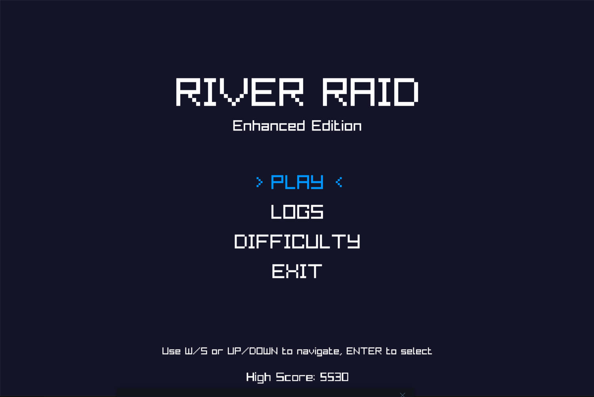
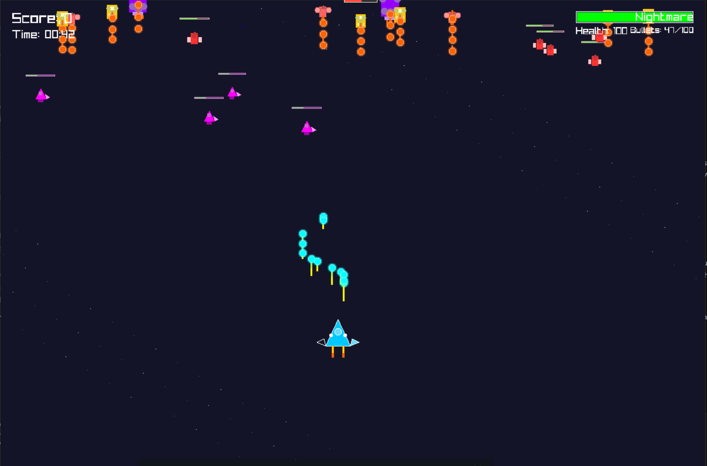
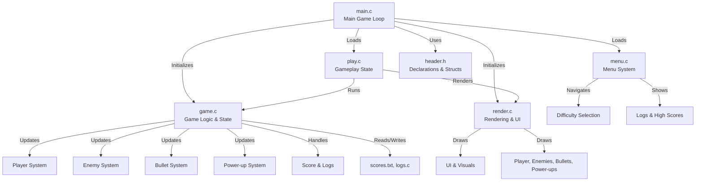

# River Raid - Enhanced Edition

A modern, graphical remake of the classic River Raid game, built in C with Raylib. This edition features beautiful graphics, smooth gameplay, and professional code structure.

---

## 📸 Screenshots


*Main menu with difficulty selection and logs*


*Intense gameplay with multiple enemy types and power-ups*

---

## 🏗️ Architecture



---

## 🎮 Features

- **Modern 2D Graphics** (Raylib-powered)
- **Smooth 60 FPS Gameplay**
- **Multiple Difficulty Levels**
- **Power-ups & Enemy Variety**
- **Persistent High Scores & Logs**
- **Professional, Modular C Code**
- **Docker Support for Easy Setup**
- **Cross-Platform: Windows, Linux, macOS**

---

## 🚀 Quick Start

### 🐳 Run with Docker (Recommended)

#### 1. Install Docker
- [Get Docker](https://docs.docker.com/get-docker/)

#### 2. Install X11 Server (for graphics)
- **Windows:** [Download Xming/XLaunch](https://sourceforge.net/projects/xming/)
- **Linux:** X11 is usually pre-installed
- **macOS:** [XQuartz](https://www.xquartz.org/)

#### 3. Start X11 Server
- **Windows:** Launch XLaunch, select 'Multiple windows', 'Start no client', enable 'Disable access control' (for local testing)
- **macOS:** Start XQuartz
- **Linux:** Usually running by default

#### 4. Set DISPLAY Environment Variable
- **Windows (PowerShell):**
  ```powershell
  $env:DISPLAY="localhost:0.0"
  ```
- **Linux/macOS:**
  ```bash
  export DISPLAY=:0
  ```

#### 5. Run the Game
```bash
docker compose up --build
```

#### 6. Troubleshooting X11
- If you see no window, ensure your firewall allows connections to X11 (port 6000)
- On Linux, you may need:
  ```bash
  xhost +local:docker
  ```

---

### 🛠️ Manual Build

#### Prerequisites
- GCC, Make, Raylib, X11 dev libraries (Linux)

#### Linux/macOS
```bash
sudo apt-get update
sudo apt-get install -y gcc make libraylib-dev libx11-dev
make
./RiverRaid
```

#### Windows
- Use `build.bat` or `build.ps1` (PowerShell)
- Or build with MinGW/MSYS2 and Raylib

---

## 🎯 Controls

**Menu:**
- `W/S` or `Up/Down`: Navigate
- `Enter/Space`: Select
- `ESC`: Back

**Gameplay:**
- `WASD`/`Arrow Keys`: Move
- `Space`/`X`: Shoot
- `P`: Pause
- `ESC`: Menu

---

## 📁 Project Structure

```
River Raid/
├── main.c          # Main entry point
├── game.c          # Game logic
├── render.c        # Rendering/UI
├── play.c          # Gameplay state
├── menu.c          # Menu system
├── header.h        # Declarations/structs
├── logs.c          # Logging
├── scores.txt      # High scores
├── Makefile        # Linux/macOS build
├── build.bat       # Windows build
├── build.ps1       # Windows PowerShell build
├── Dockerfile      # Docker build
├── docker-compose.yml # Docker Compose
└── README.md       # This file
```

---

## 🧑‍💻 Development

- Modular C code, well-commented
- Key modules: `main.c`, `game.c`, `render.c`, `play.c`, `menu.c`, `header.h`
- Persistent score/log system
- Easy to extend with new features

---

## 🛠️ Troubleshooting

- **X11 Display Issues:**
  - Ensure XLaunch/XQuartz/X11 is running
  - Set `DISPLAY` variable as above
  - On Linux: `xhost +local:docker`
- **Raylib Not Found:**
  - Install with `sudo apt-get install libraylib-dev` or use Docker
- **Windows Build Issues:**
  - Use provided scripts (`build.bat`, `build.ps1`)
  - Ensure MinGW/MSYS2 is in PATH
- **Permissions:**
  - `chmod +x RiverRaid`

---

## 👤 Author

**Arian Kheirandish**

---

## 📝 License

Open source. Modify and distribute freely.

---

## 🤝 Contributing

Pull requests and issues welcome!

---

## 🚧 Future Enhancements

- Multiplayer
- Sound & Music
- More enemies/power-ups
- Level progression
- Achievements
- Mobile port

---

**Enjoy playing River Raid Enhanced Edition! 🚀**